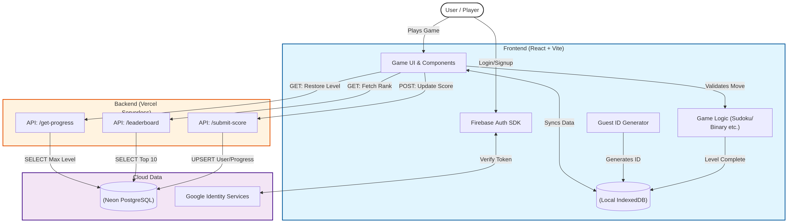

# Logic Looper 🧩


**Advanced Web-Based Puzzle & Logic Platform**

Logic Looper is a comprehensive, interactive puzzle platform engineered to test and expand users' cognitive abilities through procedurally generated logic games. Built with an offline-first, dual-state architecture, it ensures a frictionless user experience regardless of network conditions.

---

## 🚀 Features

* **Diverse Procedural Puzzle Engine:** Infinite replayability across multiple game modes:
    * **Sudoku:** Constraint satisfaction and backtracking algorithms for 9x9 grids.
    * **Binary Logic:** Procedurally generated boolean logic gate trees (AND, OR, XOR, NAND, NOR) scaling up to Half/Full-Adders.
    * **Pattern Match & Sequence Solver:** Algorithmic matrix memory testing and mathematical sequences.
    * **Deduction Grid:** Einstein-style logical elimination puzzles.
* **Offline-First Dual-Sync Architecture:** Intercepts interactions at the client level. Data is saved locally to IndexedDB first, then asynchronously synced to the cloud to prevent data loss and handle network drops.
* **Advanced Identity & Guest Migration:** Start playing instantly with a cryptographic Guest UID. Seamlessly migrate offline progress to a permanent cloud identity via Google OAuth without losing any points.
* **Interactive Data Visualization:** * **Activity Heatmap:** A GitHub-style contribution graph tracking daily puzzle completions.
    * **Live Global Leaderboard:** Real-time ranking fetching the top global players.

---

## 🛠️ Tech Stack

**Frontend**
* **React.js (Vite):** Complex UI state management and rapid HMR.
* **Tailwind CSS:** Utility-first styling for a responsive, terminal-aesthetic dark mode UI.
* **Framer Motion & Canvas Confetti:** Fluid micro-interactions and gamified reward feedback.

**Backend & Infrastructure**
* **Vercel Serverless Functions:** Secure Node.js API endpoints for database querying.
* **Neon (Serverless PostgreSQL):** Scalable relational database for global states, scores, and progression.
* **Dexie.js:** Minimalist IndexedDB wrapper managing local offline caching.
* **Firebase Authentication:** Secure OAuth 2.0 Google sign-ins and session management.

---

## 🗄️ Database Architecture

The backend relies on two primary entities to efficiently handle identities and granular progression:
* `USERS`: Central authority for identity and rankings (stores UIDs for both Guests and Google Auth users).
* `USER_PROGRESS`: Utilizes a composite primary key (`uid` + `game_id`) to track the maximum level achieved per game module via UPSERT operations.



---

## 🔮 Future Scope

* **Multiplayer Logic Duels:** Real-time WebSocket (Socket.io) integration for head-to-head procedural puzzle races.
* **Community Sandbox Level Editor:** Visual interface for users to build and share custom logic circuits.
* **Progressive Web App (PWA):** Full mobile/desktop installation with offline caching for static assets.

---

## 💻 Local Development Setup

1. **Clone the repository:**
   ```bash
   git clone [https://github.com/itzksv/logic-looper.git](https://github.com/itzksv/logic-looper.git)
   cd logic-looper

2. **Official Link to see this game build by me**
    ```bash
    logic-looper.vercel.app
